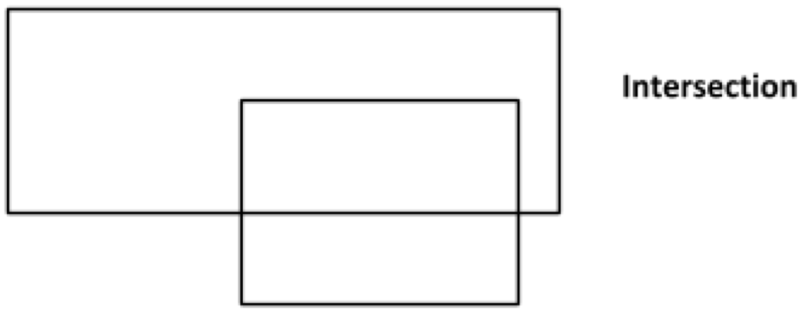
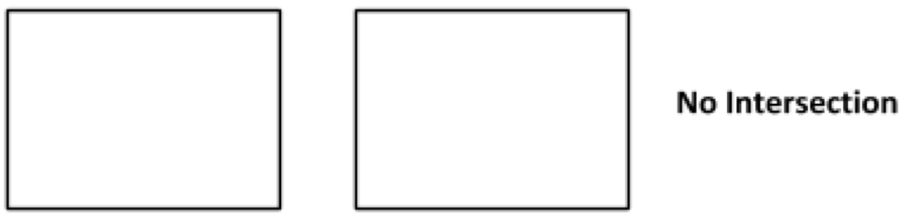
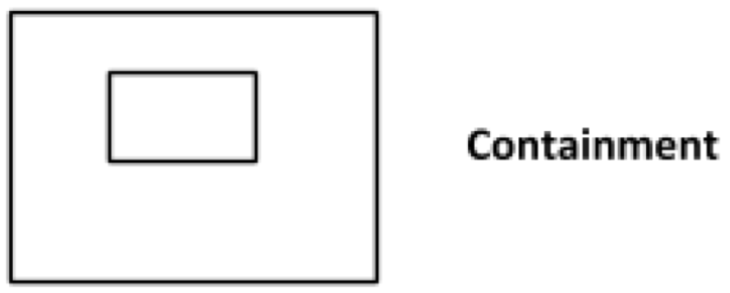
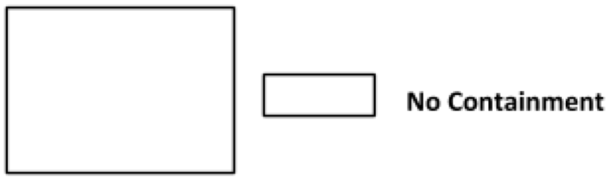
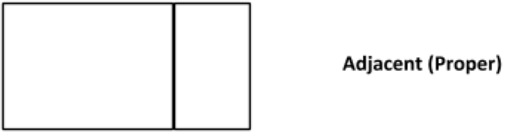
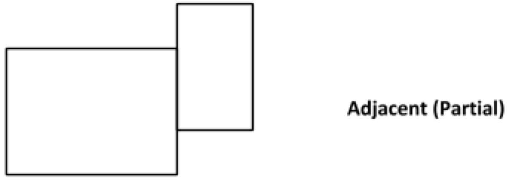
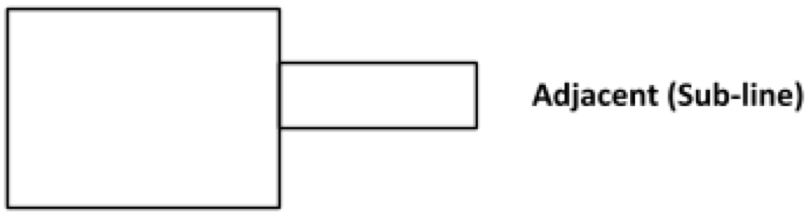
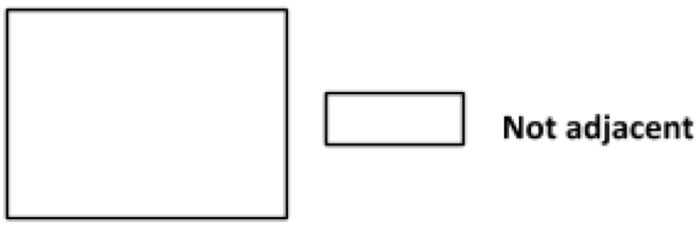

# Rectangles

This is my solution to a coding challenge as a part of an interview process.

I was so happy with my approach to get the solution, so much so that I decided to capture it in this repo.

## Objective
Implement algorithms to analyze characteristics between two rectangles and the data structure to define a rectangle:
1. ***Intersection***: Determine if the two rectangles have intersecting lines.<br>


2. ***Containment***: Determine if a rectangle is wholly contained within another rectangle.<br>


1. ***Adjacency***: Determine if the two rectangles are adjacent.<br>



## My Approach
### The Data Structure
My starting point was thinking of how to approach the data structure. Traditionally, mapping out a rectangle mathematically, one would define it by its four verteces on the cartesian plane. This yeilds in 4 sets of 2 data points, one for each vertex. The resulting data structure may look something like this: `[[0,0], [1,0], [1,1], [0,1]]` &mdash; starting from the lower left vertex and moving in a clockwise direction. I do not like this approach for two reasons:
1. There is a lot of data to work through and there is not a good way to organize it semantically.
2. I felt like finding the solution with that approach would require more mathematical calculations than was necessary for this problem. (This was just the impression/hunch, I don't actually have anything to back this claim.)

Next, I tried to see what the data structure would look like if I defined the edges instead. In my first iteration of this approach I mapped out the edges as they run on the rectangle in a counter clockwise direction starting from the lower left vertex. My initial data structure looked something like this:
&nbsp;&nbsp;&nbsp;&#8594;
&#8593;&nbsp;&nbsp;&nbsp;&nbsp;&nbsp;&nbsp;&#8595;
&nbsp;&nbsp;&nbsp;&#8592;

```
    y      x      y      x
 [[0,1], [0,1], [1,0], [1,0]]
 ```
 I quickly realized the redundancy in this approach. When traversing around the rectangle clockwise, when at the top right vertext, on the way back towards the lower left vertex, we get the negated version of the same edges as the first `y` and `x`  and thus it was sufficient to denote only one of the `y` and one of the `x` edges &mdash; `[[0,1], [0,1]]`. To improve the semantics, I changed the data structure from an array to an object:
 ```
 Def:
 {
   x: [starting x position, ending x position],
   y: [starting x position, ending x position]
 }

 Example:
 { x: [0,1], y: [0,1] }
 ```
 The result is a smaller/simplified data set over the vertex method and in my opinion it is also easier to digest.

 ## Intersection